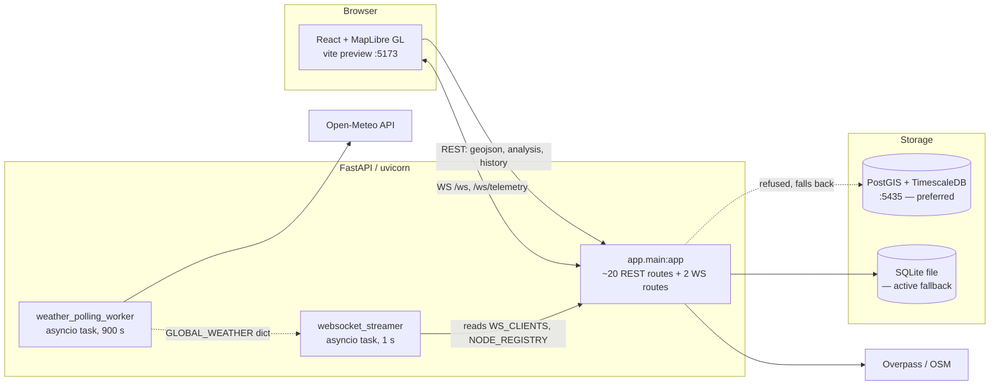
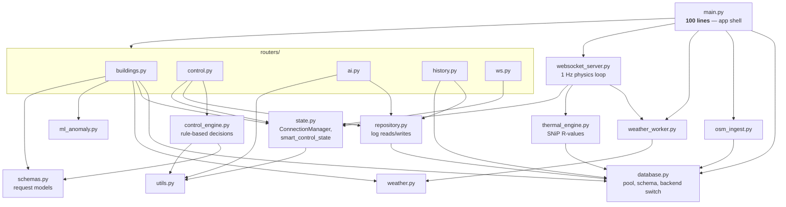
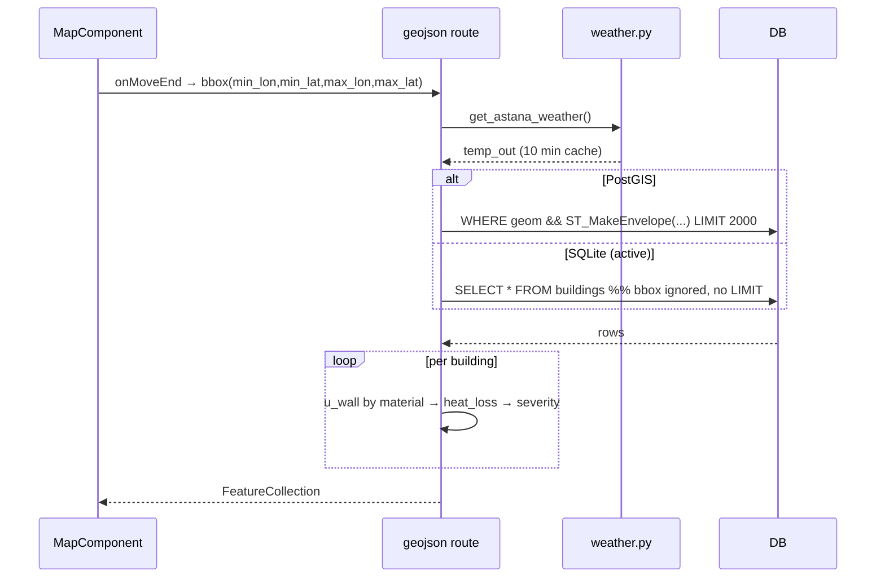
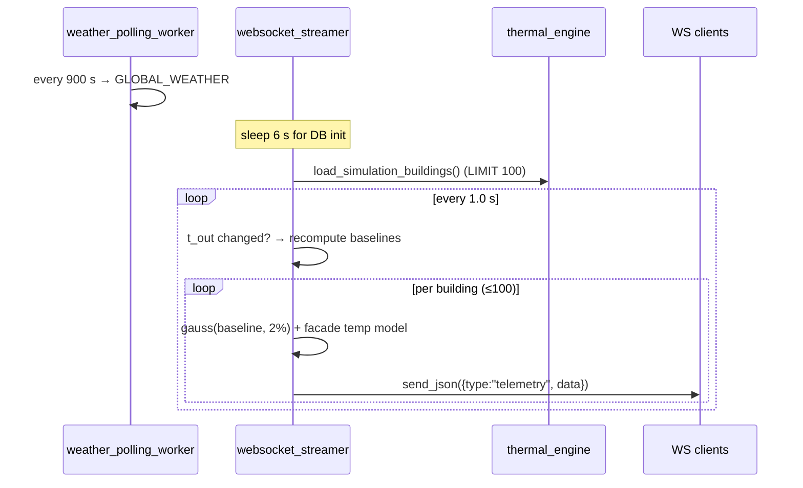

# TermoAstana — Architecture (as-built)

> **Scope of this document.** This describes what the code *actually does today*, verified against
> the running system on 2026-07-23 — not the target design. Where the current `README.md` describes
> something different, that gap is recorded in [§7 Drift](#7-drift-readme-vs-reality) rather than
> quietly reconciled. Read §7 before trusting any performance claim.

---

## 1. What the system is

A digital thermal twin of Astana. It holds a set of building footprints with material and geometry
attributes, applies a heat-loss model driven by live outdoor weather, and serves the result two ways:

- **Pull** — a GeoJSON endpoint the map calls to colour building polygons by heat loss.
- **Push** — a 1 Hz WebSocket stream of per-building telemetry packets with simulated sensor noise.

A second, originally separate concern has been merged into the same service: **traffic / smart-control**
telemetry ingest, AI advisory chat, and history endpoints, ported in from the `y_prototype`
(KHA-DIVERGENT) codebase. The marker for that import is the section comment at
[main.py:604](backend/app/main.py:604) — `PORTED TRAFFIC SIMULATOR (y_prototype)`. Everything below
that line belongs to a different product domain than everything above it.

---

## 2. Runtime topology

**Processes observed running:**

| Process | Port | Working dir | SQLite file it opens |
|---|---|---|---|
| `python backend/main.py` (PID 70012) | 8008 | project root | `termo_astana.db` — **250 buildings**, 3.6 MB |
| `uvicorn app.main:app --port 8000` (PID 78413) | 8000 | `backend/` | `backend/termo_astana.db` — **44 buildings**, 52 KB |
| `vite preview --port 5173` (PID 64480) | 5173 | `frontend/` | — |

Two backends are live at once, running identical code **against different databases**. That is not a
deployment choice; it falls out of `SQLITE_PATH` defaulting to the relative path `"termo_astana.db"`
([database.py:8](backend/app/database.py:8)), so the file resolved depends on each process's CWD.

---

## 3. Module graph

Solid = imports. `main.py` is now an app shell only; the dependency graph is acyclic.

The old `websocket_server → main` back-edge is gone. The streamer now depends on `state.py`, which
nothing else writes to, so there is no cycle and `main.py` imports in one direction only.

---

## 4. Module responsibilities

| Module | Lines | Owns |
|---|---|---|
| `main.py` | 100 | App construction, CORS, lifespan, router registration, static mount |
| `routers/buildings.py` | 413 | `geojson`, `spatial/search`, `building/{id}/analysis`, `esp32/telemetry`, `v1/stats` |
| `routers/ai.py` | 219 | `analyze`, `analyze-thermo`, `chat` + the three local fallback engines |
| `routers/control.py` | 130 | `telemetry`, `twin/telemetry`, `control/{status,decision,manual}` |
| `routers/history.py` | 115 | 4 history endpoints, `db/stats`, `config`, `forecast` |
| `routers/ws.py` | 34 | `/ws` and `/ws/telemetry` |
| `repository.py` | — | All reads/writes on the log tables |
| `state.py` | — | `ConnectionManager` + `smart_control_state` |
| `control_engine.py` | — | `estimate_power_kw`, `decide` — the smart-grid rules |
| `schemas.py` | — | The 8 request models actually in use |
| `utils.py` | — | `utc_now`, `run_db`, `clean_json_response` |

### The `DB_BACKEND` trap

`database.DB_BACKEND` starts as `"postgres"` and is flipped to `"sqlite"` inside `init_db()`, which runs
*after* every module has been imported. Any module doing `from app.database import DB_BACKEND` at import
time binds the stale `"postgres"` value and then emits `%s` placeholders into SQLite — a guaranteed
failure. The old `main.py` worked around this by reassigning its own copy inside the lifespan.

Call **`database.is_sqlite()`** instead; it reads the module global at call time. The lifespan workaround
is gone and every former `DB_BACKEND ==` comparison now goes through that helper.

---

## 5. The two data paths

### 5a. Map pull — `GET /api/v1/buildings/geojson`

The route accepts both `min_lon`/`max_lon` and `min_lng`/`max_lng` spellings and reconciles them at
[main.py:201](backend/app/main.py:201) — a sign the frontend and backend disagreed on the parameter name
at some point.

### 5b. Telemetry push — 1 Hz stream

Note the inner loop sends **one WebSocket frame per building per tick** — up to 100 sequential awaited
sends per second, per client, serialised inside the tick.

---

## 6. Storage

`database.py` picks a backend once at startup: it tries a psycopg2 pool against `DATABASE_URL`
(port 5435), and on any exception flips the module global `DB_BACKEND` to `"sqlite"` permanently
([database.py:11–26](backend/app/database.py:11)). There is no reconnect path — if Postgres arrives later,
the process keeps using SQLite until restarted.

Seven tables, created in both dialects by `init_db()`: `buildings`, `telemetry`, `traffic_logs`,
`thermo_logs`, `control_events`, `chat_history` (+ `sqlite_sequence`). On Postgres, `telemetry` and
`traffic_logs` additionally become TimescaleDB hypertables and `buildings.geom` gets a GiST index —
capabilities with no SQLite equivalent, which is what makes the fallback lossy rather than transparent.

---

## 7. Drift: README vs reality

Each row verified against the live process on port 8008.

| `README.md` claims | Verified reality | Evidence |
|---|---|---|
| PostGIS + TimescaleDB on :5435 via Docker | Docker daemon not running; connection refused → **SQLite** for the whole session | `backend_server.log`: `connection ... port 5435 failed: Connection refused. Falling back to SQLite.` |
| "Scaled to support the entire city (15,000+ buildings)" | **250 buildings** in the live DB (44 in the other) | `sqlite3 termo_astana.db 'select count(*) from buildings'` |
| "Dynamic BBOX loading … capping payload sizes" | On SQLite the bbox is **ignored entirely** — every pan returns the full table | A 0.01° box and a 3° box both return exactly **250** features |
| PostGIS `ST_MakeEnvelope` / `ST_Intersects` indexes | Unreachable on the active path | [main.py:214](backend/app/main.py:214) branches to a bare `SELECT` |
| Gemini AI analysis engine | `{"gemini_active": false}` — all AI routes serve rule-based fallbacks | `GET /api/config` |

The bbox row is the substantive one: the headline scalability feature is implemented **only** in the
branch that is not currently executing. The `LIMIT 2000` guard exists on the Postgres branch and has no
counterpart on the SQLite branch, so payload size is unbounded there.

### Four different heat-loss models

The same physical quantity is computed four ways, and they disagree:

| Site | Formula | `T_in` | `brick_soviet` R | `glass_curtain` R | `khrushchyovka_panel` R | default R |
|---|---|---|---|---|---|---|
| [thermal_engine.py:16](backend/app/thermal_engine.py:16) → WS stream | `(area / R) · ΔT` | 21.0 | **1.2** | **3.5** | **0.8** | 1.0 |
| [main.py:225](backend/app/main.py:225) → map colours | `u · area · ΔT`, `u = 1/R` | 22.0 | **0.8** | **1.2** | *(unlisted)* | **0.4** |
| [main.py:455](backend/app/main.py:455) → ROI / payback | `u · area · 37.0` | implied | **0.8** | *(unlisted)* | **0.4** | **3.0** |
| [main.py:539](backend/app/main.py:539) → ESP32 ingest | `(area · ΔT) / R` | payload | — | — | **0.4** | 1.5 |

Note the **inverted defaults** between rows 2 and 3: an unrecognised material is treated as R = 0.4
(very leaky) when colouring the map, but R = 3.0 (well insulated) when computing renovation payback —
a 7.5× swing in opposite directions, inside the same file. The ROI endpoint also hardcodes
`dt_avg = 37.0` rather than using live weather, so payback figures ignore the actual temperature.

Worked example — `brick_soviet`, 1000 m² facade, `T_out = −15 °C`:

- thermal_engine → `(1000 / 1.2) × 36` = **30 000 W**
- main.py geojson → `(1/0.8) × 1000 × 37` = **46 250 W**

**A 54 % disagreement for the same building at the same moment.** A user clicking a polygon sees the map
colour computed by one model and the live telemetry number computed by another. For `glass_curtain` the
R-values differ by ~3×; for `khrushchyovka_panel`, 2×. The material→U-value block is additionally
copy-pasted verbatim between the SQLite and Postgres branches of the same function
([main.py:225](backend/app/main.py:225) and [main.py:283](backend/app/main.py:283)), so any correction has
to be made in both. Severity thresholds (200k/100k/50k W) are likewise duplicated in three places.

---

## 8. Cleanup backlog

**Structural items are done** (2026-07-23). The split was verified behaviour-preserving: all 20 routes
present and unchanged, every endpoint payload byte-identical apart from the restart timestamp and live
weather drift, and the WebSocket confirmed still streaming telemetry.

- ✅ **`routers/` introduced**, `main.py` reduced 1377 → 100 lines.
- ✅ **`_save_*` / `_fetch_*` moved to `repository.py`**; `?`/`%s` branching replaced by
  `database.placeholder()`.
- ✅ **`WS_CLIENTS` / `NODE_REGISTRY` relocated to `state.py`** as a `ConnectionManager`; the
  `websocket_server → main` cycle is gone.
- ✅ **`buildings_db.py` and `city_map.py` deleted**; `schemas.py` rewritten to hold the live models.

### Still open — these change displayed numbers, so they need a decision

1. **Unify the heat-loss model.** Four R-tables disagree (§7). Pick one, move it into
   `thermal_engine.py`, and have the geojson, ROI and ESP32 paths call it. Fix the inverted defaults at
   the same time.
2. **Apply the bbox filter on the SQLite path**, with a `LIMIT` to match Postgres. Without this the
   README's central performance claim is false on the default backend.
3. **Fix the connection leak in `/api/forecast`.** `conn = get_db().__enter__()`
   ([routers/history.py](backend/app/routers/history.py)) enters the context manager without ever
   exiting it. The generator is unreferenced, so whenever CPython collects it the `finally:` in
   `get_db()` closes the connection — sometimes before `read_sql_query` has run, which is why
   `Cannot operate on a closed database` appears in the log. Pre-existing, not introduced by the
   refactor; the endpoint swallows the error and returns `insufficient_data`.

Also worth deciding, though outside the code: shut down one of the two backends (they are serving
different datasets), and set `SQLITE_PATH` to an absolute path so the DB opened no longer depends on the
directory the process was launched from.

Also worth deciding, though outside the code: shut down one of the two backends (they are serving
different datasets), and set `SQLITE_PATH` to an absolute path so the DB opened no longer depends on the
directory the process was launched from.

---

## 9. Consolidation: this service vs. KHA-DIVERGENT

The combined "Astana Twin" flagship is being assembled in the **KHA-DIVERGENT** repo, whose backend is
`y_prototype/main.py`. That file and this one are **forks of a common ancestor that have drifted**, so the
merge is a deduplication problem, not an integration problem.

|  | termo astana (`backend/app/`) | KHA-DIVERGENT (`y_prototype/`) |
|---|---|---|
| Backend size | `main.py` 1377 lines **+ 10 modules** | `main.py` **1816 lines**, 0 modules |
| Python files | 13 | 3 (`main.py`, `mock_esp32.py`, `twin_simulator.py`) |
| DB access | pooled `get_db()` context manager, commit/rollback, WAL | raw `_db_connect()` + `conn.close()`, no pooling |
| WS connections | bare `WS_CLIENTS: List[WebSocket]` global | `ConnectionManager` class |
| Domains | 5 | 7 |

**Duplicated in both, essentially verbatim** — ~15 routes and ~20 functions: `/api/telemetry`,
`/api/twin/telemetry`, `/api/control/{status,decision,manual}`, `/api/analyze`, `/api/analyze-thermo`,
`/api/chat`, `/api/history/{traffic,thermo,chat,control}`, `/api/db/stats`, `/api/config`, `/api/forecast`,
`/ws`; plus `_local_smart_control`, `_estimate_power_kw`, `_save_*`, `_fetch_*`, `clean_json_response`,
`utc_now`, and 7 Pydantic models. `_local_smart_control` and `_estimate_power_kw` are byte-identical.

**Only in termo astana** — the thermal/spatial stack: `/api/v1/buildings/geojson`, `/api/v1/spatial/search`,
`/api/v1/building/{id}/analysis`, `/api/v1/esp32/telemetry`, `/api/v1/stats`, plus `osm_ingest.py`,
`thermal_engine.py`, `weather.py`, `weather_worker.py`, `websocket_server.py`, `database.py`.

**Only in KHA** — the wider civil/urban stack: structural, mobility and fleet history domains,
`/api/scenario/compare`, `estimate_time_to_concern` (geotechnical regression),
`calculate_corridor_travel_times` (NetworkX), `compute_idw_grid` (IDW interpolation), a second
`IsolationForest` for structural health, and the richer `UnifiedTelemetry` model.

### Where each fork is ahead

The forks did not drift uniformly — each is ahead on a different axis, which is what makes "just pick one"
the wrong move:

- **termo astana is ahead on infrastructure.** Its `_fetch_traffic_history` uses the pooled `get_db()`
  context manager; KHA's identical function still opens a raw connection and closes it by hand. Same for
  the rest of the `_fetch_*` family. termo astana is the *refactored* copy.
- **KHA is ahead on breadth and on WebSocket handling.** Its `ConnectionManager`
  ([y_prototype/main.py:649](../y_prototype/main.py:649)) is precisely the encapsulation termo astana lacks —
  adopting it resolves cleanup item 5 and the `websocket_server → main` circular import in one step.

**Suggested merge direction:** take termo astana's `app/` package as the skeleton and its `database.py` as
the single data layer; lift KHA's `ConnectionManager` in as `state.py`; port KHA's four exclusive domains in
as routers; and delete the duplicated half of KHA's `main.py` rather than merging it line by line. Every
shared function should end up with exactly one definition.
